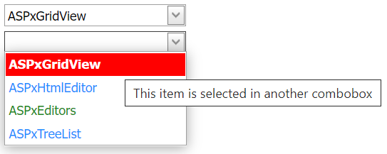

<!-- default badges list -->

[](https://supportcenter.devexpress.com/ticket/details/E4100)
[](https://docs.devexpress.com/GeneralInformation/403183)
<!-- default badges end -->
# Combo Box for ASP.NET Web Forms - How to customize an item's appearance
<!-- run online -->
**[[Run Online]](https://codecentral.devexpress.com/e4100/)**
<!-- run online end -->

This example demonstrates how to create a combo box editor and use its client-side functionality to specify the appearance of the editor's items.



## Overview

Create a combo box editor and use its client-side [GetSelectedIndex](https://docs.devexpress.com/AspNet/js-ASPxClientComboBox.GetSelectedIndex) method to identify the editor’s selected item by its index. Call the editor's [SetItemTooltip](https://docs.devexpress.com/AspNet/js-ASPxClientComboBox.SetItemTooltip(index-tooltip)) method to assign a tooltip to the specified item. To customize the item's style settings, use the editor's client-side [AddItemCssClass](https://docs.devexpress.com/AspNet/js-ASPxClientComboBox.AddItemCssClass(index-className)) and [RemoveItemCssClass](https://docs.devexpress.com/AspNet/js-ASPxClientComboBox.RemoveItemCssClass(index-className)) methods.

```js
function onSelectedIndexChanged(sender, target) {
    if (sender.PrevIndex != undefined) {
        target.SetItemTooltip(sender.PrevIndex, "");
        target.RemoveItemCssClass(sender.PrevIndex, "MySelectedItem");
    }
    target.SetItemTooltip(sender.GetSelectedIndex(), "This item is selected in another combobox");
    target.AddItemCssClass(sender.GetSelectedIndex(), "MySelectedItem");
    sender.PrevIndex = sender.GetSelectedIndex();
}
```

```aspx
<dx:ASPxComboBox ID="MyTestComboBox1" runat="server" ClientInstanceName="combo1">
    <Items>
        <!-- ... -->
    </Items>
    <ClientSideEvents SelectedIndexChanged="function (s, e) { onSelectedIndexChanged(s, combo2); }"
        Init="SetItemColor" EndCallback="SetItemColor" />
</dx:ASPxComboBox>
<dx:ASPxComboBox ID="MyTestComboBox2" runat="server" ClientInstanceName="combo2">
    <Items>
        <!-- ... -->
    </Items>
    <ClientSideEvents SelectedIndexChanged="function (s, e) { onSelectedIndexChanged(s, combo1); }"
        Init="SetItemColor" EndCallback="SetItemColor" />
</dx:ASPxComboBox>
```

## Files to Review

* [Default.aspx](./CS/Default.aspx) (VB: [Default.aspx](./VB/Default.aspx))
* [Default.aspx.cs](./CS/Default.aspx.cs) (VB: [Default.aspx.vb](./VB/Default.aspx.vb))
